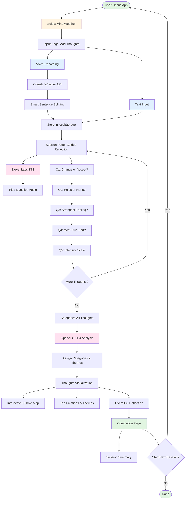

# 🧠 Brain Dump

> **Quiet the spin. Organise the chaos. Finally breathe again.**

Brain Dump is a compassionate mental wellness application that helps you slow down racing thoughts, explore your inner world through guided reflection, and gain clarity when your mind feels overwhelmed.

---

## 📖 Description

Brain Dump is a **non-therapeutic support tool** designed to help users manage overwhelming thoughts and emotions. Unlike traditional journaling apps, Brain Dump combines:

- 🎤 **Voice & Text Input** - Express your thoughts naturally through speech or typing
- 🤖 **AI-Powered Analysis** - Intelligent categorization and compassionate insights using GPT-4
- 🎯 **Guided Reflection** - 5-question framework to explore each thought mindfully
- 🗺️ **Visual Mapping** - Interactive thought bubble visualization organized by themes
- 🔊 **Voice Narration** - ElevenLabs text-to-speech guides you through reflection

The application helps you understand patterns in your thinking, identify emotions, and gain perspective on what's weighing on your mind—all in a safe, private, and judgment-free space.

---

## 🎯 Use Cases

### **1. Overwhelmed by Racing Thoughts**
When your mind feels like it's spinning with too many thoughts at once, Brain Dump helps you:
- Capture thoughts quickly without losing them
- Organize scattered thinking into clear categories
- See patterns you might have missed
- Gain distance and perspective

### **2. Late-Night Anxiety**
When worries keep you awake at 3 AM:
- Use voice input to express thoughts without screens
- Guided reflection helps process what's bothering you
- Visualize whether thoughts are actionable or need acceptance
- Get compassionate AI insights to ease your mind

### **3. Decision-Making Clarity**
When you're stuck on a difficult decision:
- Dump all perspectives without judgment
- See which thoughts help vs. hurt
- Identify underlying emotions driving the decision
- Understand what feels most true to you

### **4. Emotional Check-ins**
For regular mental wellness maintenance:
- Track your "mind weather" over time
- Notice emotional patterns and triggers
- Practice structured self-reflection
- Build awareness of your mental state

### **5. Processing Difficult Conversations**
After a challenging interaction:
- Voice-record your immediate feelings
- Explore whether thoughts are rumination or actionable
- Identify core emotions and themes
- Gain clarity before responding

---

## 🏗️ How It Was Built

### **Tech Stack**

#### **Frontend**
- **Next.js 13.5** - React framework with server-side rendering
- **TypeScript** - Type-safe development
- **Tailwind CSS** - Utility-first styling with animations
- **Radix UI** - Accessible component primitives
- **Lucide React** - Beautiful icon library

#### **AI & Speech APIs**
- **OpenAI GPT-4** - Thought categorization and compassionate insights
- **OpenAI Whisper** - Speech-to-text transcription
- **ElevenLabs** - Natural text-to-speech voice narration

#### **Audio Processing**
- **Web Audio API** - Real-time audio level visualization
- **MediaRecorder API** - Browser-based voice recording
- **WebM Format** - Optimized audio capture

#### **State & Storage**
- **localStorage** - Client-side session persistence
- **React Hooks** - Modern state management
- **Supabase** - Database (configured for future cloud sync)

### **Architecture**



### **Key Design Decisions**

1. **Client-Side Storage** - Uses localStorage for privacy and instant access (no server latency)
2. **Sequential Reflection** - One thought at a time prevents overwhelm
3. **AI-Powered Categorization** - GPT-4 provides nuanced understanding beyond keyword matching
4. **Voice-First Design** - Natural expression when typing feels too effortful
5. **Compassionate Language** - All prompts and insights use gentle, non-judgmental language
6. **Visual Feedback** - Real-time audio levels and bubble visualization make progress tangible

---

## 🚀 How to Use It

### **Prerequisites**

- Node.js 18+ and npm installed
- OpenAI API key ([Get it here](https://platform.openai.com/api-keys))
- ElevenLabs API key ([Get it here](https://elevenlabs.io/))

### **Installation**

1. **Clone the repository**
   ```bash
   git clone https://github.com/fozagtx/brainDump.git
   cd brainDump
   ```

2. **Install dependencies**
   ```bash
   npm install
   ```

3. **Set up environment variables**

   Create a `.env.local` file in the root directory:
   ```env
   OPENAI_API_KEY=your_openai_api_key_here
   ELEVENLABS_API_KEY=your_elevenlabs_api_key_here
   ```

   See `API_KEYS_SETUP.md` for detailed configuration instructions.

4. **Run the development server**
   ```bash
   npm run dev
   ```

5. **Open your browser**

   Navigate to [http://localhost:3000](http://localhost:3000)

### **Usage Guide**

#### **Step 1: Set Your Mind Weather**
Choose how your mind feels right now:
- ☀️ **Sunny** - Clear and calm
- ⛅ **Cloudy** - Somewhat unclear
- ⛈️ **Stormy** - Intense and chaotic
- 🌫️ **Foggy** - Confused or numb

#### **Step 2: Dump Your Thoughts**
- **Type** your thoughts in the text area, or
- **Click the microphone** to record your voice (auto-transcribes)
- Add as many thoughts as you want
- Click **"Continue"** when ready

#### **Step 3: Guided Reflection**
For each thought, answer 5 questions:
1. Can this be changed or must it be accepted?
2. Does this help or hurt you?
3. What feeling shows up most strongly?
4. What part of this feels most true?
5. How intense is this feeling? (1-10 scale)

The app will read questions aloud—just listen and respond.

#### **Step 4: Visualize & Explore**
- See all your thoughts as **interactive bubbles**
- Filter by emotion category
- View **top emotions** and themes
- Read your personalized **AI reflection**

#### **Step 5: Complete Session**
- Review your session summary
- Reflect on the insights gained
- Start a new session anytime

---

## 📁 Project Structure

```
brainDump/
├── app/                      # Next.js app directory
│   ├── api/                  # API routes
│   │   ├── transcribe/       # OpenAI Whisper speech-to-text
│   │   ├── categorize-thoughts/ # GPT-4 thought analysis
│   │   ├── narrate/          # ElevenLabs text-to-speech
│   │   └── analyze-thought/  # Individual thought insights
│   ├── input/[id]/           # Thought input page
│   ├── session/[id]/         # Guided reflection page
│   ├── thoughts/[id]/        # Thought visualization page
│   ├── complete/[id]/        # Session completion page
│   └── page.tsx              # Home page
├── components/               # React components
│   └── ui/                   # Radix UI components
├── lib/                      # Utility functions
│   ├── storage.ts            # localStorage helpers
│   └── utils.ts              # Helper functions
├── hooks/                    # Custom React hooks
├── public/                   # Static assets
└── tailwind.config.ts        # Tailwind configuration
```

---

## 🔐 Privacy & Security

- **No data leaves your device** except for AI processing
- API calls to OpenAI and ElevenLabs are encrypted
- **No account required** - fully anonymous
- Session data stored locally in your browser
- No tracking or analytics

---

## 🤝 Contributing

Contributions are welcome! Please feel free to submit a Pull Request.

1. Fork the repository
2. Create your feature branch (`git checkout -b feature/AmazingFeature`)
3. Commit your changes (`git commit -m 'Add some AmazingFeature'`)
4. Push to the branch (`git push origin feature/AmazingFeature`)
5. Open a Pull Request

---

## 📄 License

This project is open source and available under the MIT License.

---

## ⚠️ Disclaimer

**Brain Dump is not a substitute for professional mental health care.** If you're experiencing a mental health crisis, please contact a qualified mental health professional or crisis helpline immediately.

- **US Crisis Hotline**: 988 (Suicide & Crisis Lifeline)
- **Crisis Text Line**: Text "HELLO" to 741741
- **International**: [Find your local crisis line](https://findahelpline.com/)

---

## 🙏 Acknowledgments

- **OpenAI** - GPT-4 and Whisper API
- **ElevenLabs** - Natural voice synthesis
- **Radix UI** - Accessible component primitives
- **Vercel** - Next.js framework and hosting

---

Made with ❤️ for anyone who needs a moment to breathe
